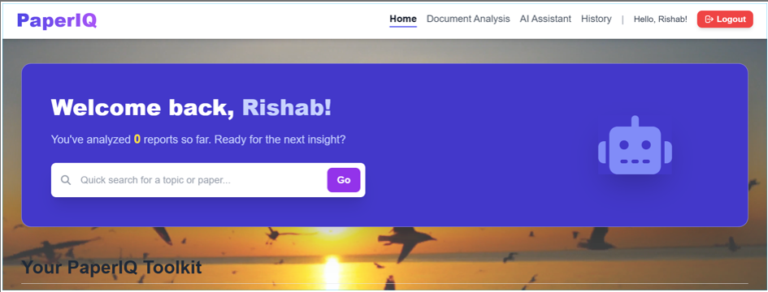
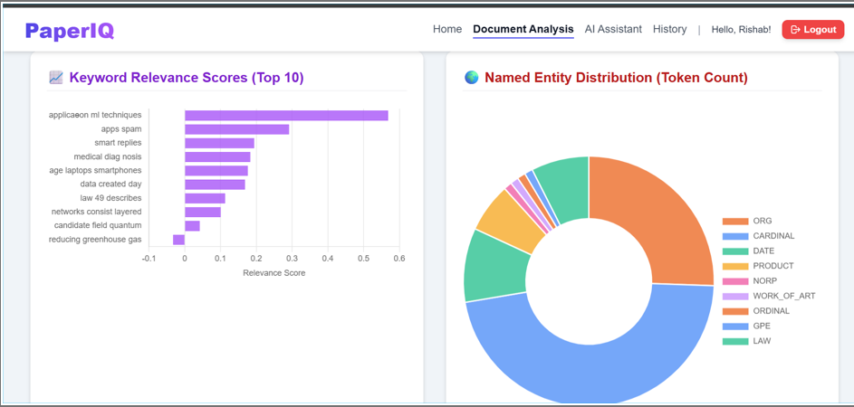

# 📄 Research Navigator: Semantic Paper Analyzer (PaperIQ)

> 🚀 An advanced full-stack AI platform for rapid document analysis, semantic synthesis, and academic insight extraction.

---

## 📌 Project Overview

The exponential growth of academic literature and digital documents has made research increasingly complex and time-consuming.

**Research Navigator (PaperIQ)** solves this problem by providing an **AI-powered system** that enables:

- Deep semantic understanding of documents  
- Multi-source research synthesis  
- Instant extraction of meaningful insights  

Unlike traditional tools, PaperIQ goes beyond keyword search and performs **context-aware analysis** using modern NLP and LLMs.

---

## ✨ Key Features

### 🔍 Hybrid Summarization
- **Abstractive**: BART-Large-CNN (HuggingFace Transformers)
- **Extractive**: TextRank (NetworkX + Sentence Transformers)

### 🤖 Search-Grounded AI Assistant
- Powered by **Gemini 2.5 Flash API**
- Fetches and synthesizes up to **5 research papers**
- Generates one cohesive, structured report

### 🧠 Deep NLP Insights
- Named Entity Recognition (spaCy)
- Keyword Extraction (KeyBERT)
- Readability Score (Flesch-Kincaid Grade)

### 📊 Interactive Visualizations
- Entity distribution charts  
- Keyword relevance graphs  
- Sentence length histograms  
- Readability metrics  

### 💾 Persistent History
- MongoDB-based storage  
- User-specific analysis history  
- Secure authentication system  

---

## 🏗️ System Architecture

### 🔄 Data Flow

```
User Input → Document Upload / Query
        ↓
Preprocessing (NLTK)
        ↓
NLP Pipeline
   ├── NER (spaCy)
   ├── Keywords (KeyBERT)
   ├── Summarization (BART + TextRank)
        ↓
Gemini AI (Search + Synthesis)
        ↓
MongoDB Storage
        ↓
Dashboard & Visualizations
```

---

## 🧩 Core Modules

### 🔐 1. Authentication & Persistence
- Secure login & registration  
- OTP Email Verification  
- MongoDB user profiles  

### 📄 2. Document Processing
- PDF (PyMuPDF)  
- DOCX (python-docx)  
- Web content extraction  

### 🧠 3. NLP Analysis Engine
- Summarization (Abstractive + Extractive)  
- Named Entity Recognition  
- Keyword extraction  
- Readability scoring  

### 🌐 4. AI Research Assistant
- Gemini API integration  
- Google Search grounding  
- Multi-paper synthesis  

### 📊 5. Visualization & Reporting
- Chart.js dashboards  
- ROUGE metrics  
- Interactive analytics  

---

## 🐳 Why Docker?

- ✅ Environment consistency across machines  
- ✅ Preloaded ML models (BART, spaCy, NLTK)  
- ✅ Microservices architecture (Flask + MongoDB)  
- ✅ One-command deployment  

---

## 🛠️ Tech Stack

| Category | Tools |
|--------|------|
| Backend | Python, Flask, Werkzeug |
| Database | MongoDB (PyMongo) |
| AI/LLM | Gemini 2.5 Flash API |
| NLP | BART, spaCy, KeyBERT, NLTK |
| Data Science | NumPy, Scikit-learn, NetworkX |
| Frontend | Jinja2, Tailwind CSS, Chart.js |
| Docs Handling | PyMuPDF, python-docx |

---

## 🚀 Quick Start

### 🔧 Prerequisites
- Docker Desktop  
- Gemini API Key (Google AI Studio)  

---

### 📥 Installation

```bash
# Clone the repository
git clone https://github.com/BSshishodia/ResearchNavigator-AI.git
cd ResearchNavigator-AI
```

---

### ⚙️ Environment Setup

Create a `.env` file:

```env
GEMINI_API_KEY=your_key_here
MONGO_URI=mongodb://db:27017/paperiq_db
SECRET_KEY=your_secret_key
```

---

### ▶️ Run with Docker

```bash
docker-compose up --build
```

---

### 🌐 Access the App

```
http://localhost:8080
```

---

## 📊 Outcomes & Capabilities

- 📌 Intelligent Information Extraction  
- 📌 Semantic Search (Meaning-based retrieval)  
- 📌 Multi-paper synthesis  
- 📌 Research recommendation system  
- 📌 Conceptual knowledge structuring  
- 📌 Scalable document processing  

---

## 🧪 Testing & Results

- ✔ Stable user authentication with OTP  
- ✔ Accurate document processing (PDF/DOCX)  
- ✔ Effective AI-powered synthesis  
- ✔ Reliable MongoDB persistence  
- ✔ Fully responsive UI with interactive visuals  

---

## 🎯 Future Enhancements

- 🔗 Knowledge Graph Visualization  
- 📚 Advanced Paper Recommendation System  
- 🧠 Fine-tuned domain-specific NLP models  
- ☁️ Cloud deployment (AWS / Hugging Face Spaces)  
- 🛡️ Role-based admin dashboard  

---

## 📷 Preview

```



```

---

## 👨‍💻 Author

**Bhav Shishodia**  
M.Tech AI/ML  

---

## ⭐ Final Thoughts

Research Navigator (PaperIQ) demonstrates how **AI + NLP + Web Systems** can transform research workflows by:

- Reducing manual effort  
- Enhancing understanding  
- Enabling faster decision-making  

---

⭐ If you like this project, consider giving it a star!
